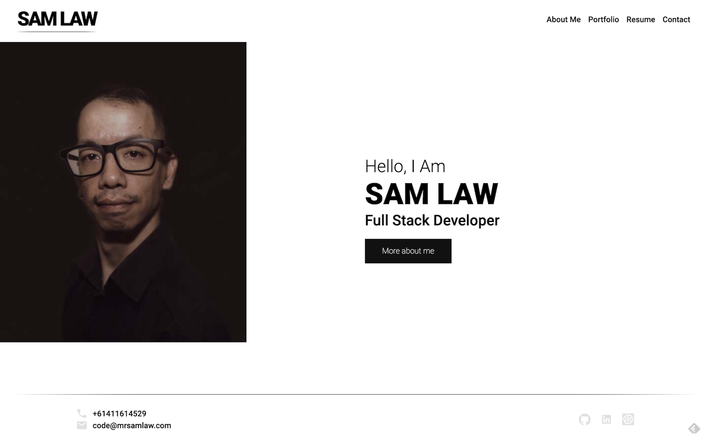

# Mr Sam Law - Full Stack Developer React Porfolio

## Deployment

The portfolio has been deployed at:
[https://mrsamlaw.github.io/ReactPortfolio/](https://mrsamlaw.github.io/ReactPortfolio/)

## Technologies

- HTML
- SCSS
- React (Create React App)
- JavaScript
- Additional NPM Libraries - Material-UI Icons, Formik, React-PDF

## Description

A fresh build of my Portfolio, delving into React.

## What We Did

Complete build of the site using React and SASS.
Icons use the Material-UI Icons Library.
Contact Form uses Formik Library for input and validation.
React-PDF package is used to display Resume.

## Screenshot

